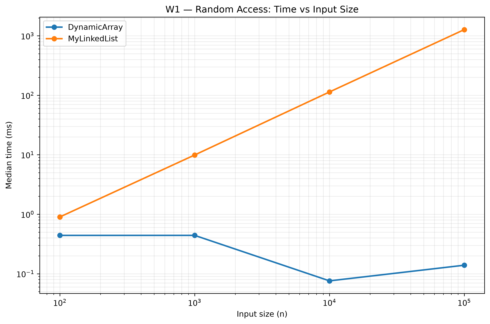
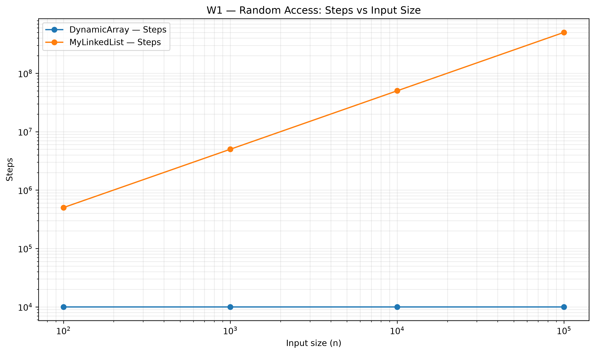
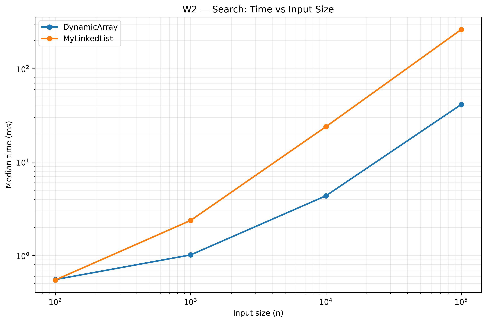
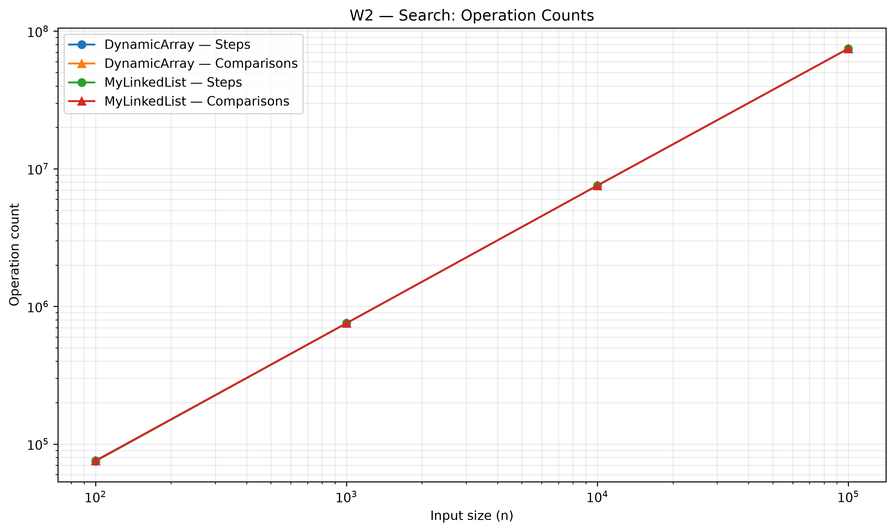
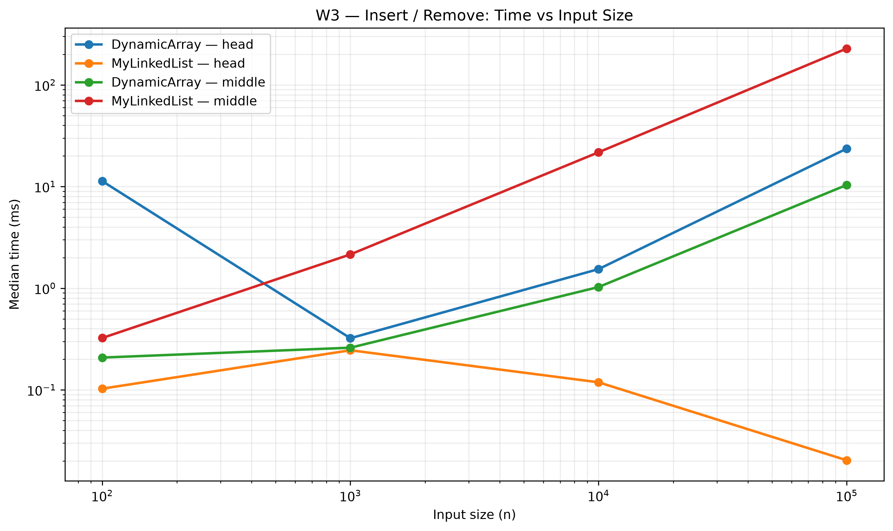
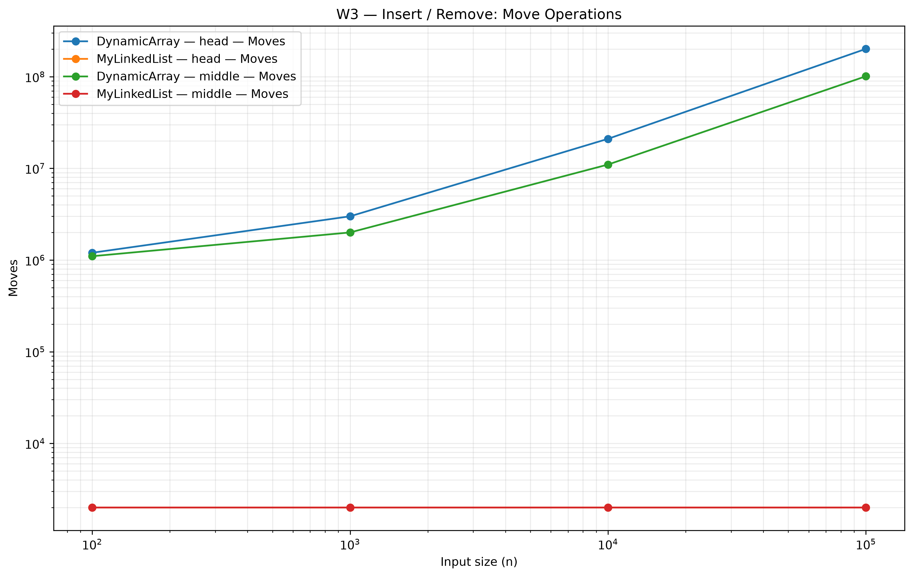
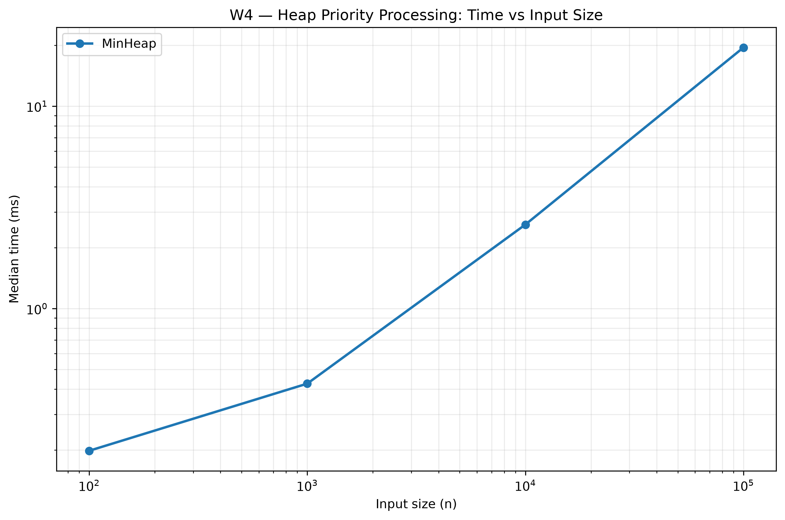
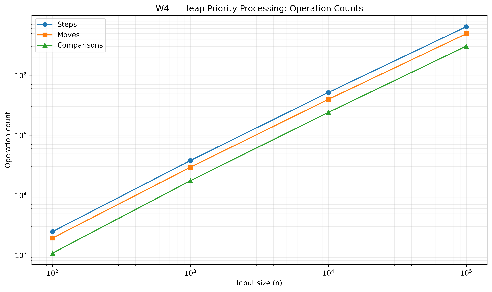

# DAA Assignment 2 — Data Structures
## Performance Analysis of DynamicArray, MyLinkedList and MinHeap

**Student:** Suyash Arora  
**Course:** Design and Analysis of Algorithms  
**Assignment:** Assignment 2 — Data Structures  

---

# 1. Introduction

This assignment implements three data structures from scratch: `DynamicArray`,
`MyLinkedList`, and `MinHeap`. The implementations store primitive `int` values
and do not use Java's built-in `ArrayList`, `LinkedList`, or `PriorityQueue`.

The main goal is not only to implement the structures correctly, but also to
measure their practical performance using explicit operation counters. Four
workloads were tested for input sizes of 100, 1,000, 10,000 and 100,000.

The benchmark records execution time, steps, moves and comparisons. Each case
was executed using a warm-up run followed by five measured runs, with the
median execution time reported in `results.csv`.

---

# 2. Implemented Data Structures

## 2.1 DynamicArray

`DynamicArray` stores elements in a primitive `int[]` array.

When the array becomes full, a new array with twice the previous capacity is
created and the existing elements are copied into it. This gives `add(x)`
amortized constant time.

The main operations are:

- `add(x)`
- `add(index, x)`
- `remove(index)`
- `get(index)`
- `contains(x)`

The contiguous memory layout provides good CPU cache locality because
neighboring elements are stored close together.

---

## 2.2 MyLinkedList

`MyLinkedList` is implemented as a singly linked list. Each node contains an
`int` value and a reference to the next node.

Insertion and removal at the head require constant time, while operations at
other positions require traversal from the head.

The main operations are:

- `add(x)`
- `add(index, x)`
- `remove(index)`
- `get(index)`
- `contains(x)`

Unlike the array, linked-list nodes are individually allocated objects, which
introduces pointer chasing and object-management overhead.

---

## 2.3 MinHeap

`MinHeap` is implemented using a primitive integer array and follows the
binary min-heap property:

> `parent <= child`

`insert(x)` places the new value at the end and restores the heap using
bubble-up. `extractMin()` removes the root and restores the heap using
bubble-down.

The implemented operations are:

- `insert(x)`
- `peekMin()`
- `extractMin()`

The heap provides constant-time access to the minimum element and logarithmic
time insertion and extraction in the general case.

---

# 3. Complexity Analysis

## 3.1 DynamicArray

| Operation | Best | Average | Worst | Auxiliary Space | Justification |
|---|---:|---:|---:|---:|---|
| `add(x)` | Θ(1) | Θ(1) amortized | Θ(n) | Θ(n) | Usually writes at the end; resizing copies n elements. |
| `add(index,x)` | Θ(1) | Θ(n) | Θ(n) | Θ(n) | Elements after the index may need to be shifted. |
| `remove(index)` | Θ(1) | Θ(n) | Θ(n) | Θ(n) | Removing the last element needs no shifting; earlier positions do. |
| `get(index)` | Θ(1) | Θ(1) | Θ(1) | Θ(n) | Direct array indexing requires one cell access. |
| `contains(x)` | Θ(1) | Θ(n) | Θ(n) | Θ(n) | Linear search may inspect many elements. |

---

## 3.2 MyLinkedList

| Operation | Best | Average | Worst | Auxiliary Space | Justification |
|---|---:|---:|---:|---:|---|
| `add(x)` | Θ(1) | Θ(n) | Θ(n) | Θ(n) | The implementation traverses to the final node. |
| `add(index,x)` | Θ(1) | Θ(n) | Θ(n) | Θ(n) | Head insertion is constant; other positions require traversal. |
| `remove(index)` | Θ(1) | Θ(n) | Θ(n) | Θ(n) | Removing the head is constant; other positions require traversal. |
| `get(index)` | Θ(1) | Θ(n) | Θ(n) | Θ(n) | The list must follow links to reach the requested node. |
| `contains(x)` | Θ(1) | Θ(n) | Θ(n) | Θ(n) | A sequential search may inspect every node. |

---

## 3.3 MinHeap

| Operation | Best | Average | Worst | Auxiliary Space | Justification |
|---|---:|---:|---:|---:|---|
| `insert(x)` | Θ(1) | Θ(log n) | Θ(log n) | Θ(n) | The new element may move from a leaf to the root. |
| `peekMin()` | Θ(1) | Θ(1) | Θ(1) | Θ(n) | The minimum is always stored at index 0. |
| `extractMin()` | Θ(1) | Θ(log n) | Θ(log n) | Θ(n) | The last element may move down through the heap. |

The auxiliary space of all three structures is Θ(n), because each structure
stores n elements, although the memory layout differs significantly.

---

# 4. Loop Invariant Proofs

## 4.1 DynamicArray — `contains(x)`

The implementation scans the array from index 0 toward the final element.

### Invariant

Before every iteration at index `i`, all elements at positions
`0 ... i-1` have already been checked and none of them is equal to `x`.

### Initialization

Before the first iteration, `i = 0`. No elements have been checked, so the
statement is trivially true.

### Maintenance

During an iteration, the current element `data[i]` is compared with `x`.

If the values are equal, the method immediately returns `true`.

If they are different, the current element has been checked and is known not
to equal `x`. The loop then advances to `i + 1`, so all elements before the new
index have been checked and are not equal to `x`.

Therefore, the invariant remains true.

### Termination

If the loop terminates without returning `true`, every element in the array
has been checked and none is equal to `x`.

### Conclusion

Therefore, `contains(x)` returns `true` exactly when the value exists in the
array and otherwise returns `false`.

---

## 4.2 MinHeap — `bubbleDown(index)`

`bubbleDown` restores the min-heap property after the root is replaced by the
last element.

### Invariant

Before each iteration, every subtree below the current position that has
already been processed satisfies the min-heap property, and the only possible
violation is at the current index.

### Initialization

Initially the current index is the root. Before bubble-down starts, the
replacement value may violate the heap property with one or both children,
while the remaining subtrees are already valid heaps.

Thus the invariant holds.

### Maintenance

The algorithm compares the current node with its left and right children and
selects the smallest value.

If the current node is already the smallest, the heap property is restored and
the loop terminates.

Otherwise, the current node is swapped with the smaller child. The subtree
above the new position becomes valid, and the possible violation moves to the
new current index.

Therefore the invariant remains true.

### Termination

The loop terminates either when the current node is smaller than both children
or when the current node becomes a leaf.

In both cases, no heap-property violation remains.

### Conclusion

Therefore, `bubbleDown` correctly restores the min-heap property after
`extractMin()`.

---

# 5. Benchmark Methodology

Four workloads were used.

### W1 — Random Access

Both `DynamicArray` and `MyLinkedList` were filled with n values. Then 10,000
random `get(index)` operations were performed.

The DynamicArray performs direct indexing, while MyLinkedList must traverse
from the head to reach the requested position.

### W2 — Search

Both structures were tested with 1,000 `contains(x)` queries. Half of the
queries used values present in the structure and half used absent values.

### W3 — Insert and Remove

Two variants were tested:

- **Head:** 1,000 insertions and 1,000 removals at index 0.
- **Middle:** 1,000 insertions and 1,000 removals at index n/2.

Both DynamicArray and MyLinkedList were measured.

### W4 — Priority Processing

For each n, n values were inserted into a MinHeap and then n values were
extracted.

The extracted sequence was checked to ensure it was non-decreasing.

The benchmark sizes were:

`100, 1,000, 10,000, 100,000`

The same deterministic random seed, `42`, was used for reproducibility.

---

# 6. Results and Plots

The benchmark produced `results/results.csv` containing 36 benchmark result
rows plus the CSV header.

The generated plots are stored in `results/plots/`.

## W1 — Random Access

### Time vs n

### Steps vs n

DynamicArray requires a constant number of steps for indexed access, while
MyLinkedList requires traversal through nodes. Therefore, the number of list
steps increases strongly as n increases.

---

## W2 — Search

### Time vs n

### Operation Counts

Both structures use linear search, but MyLinkedList performs traversal through
separately allocated nodes. DynamicArray benefits from contiguous storage and
better cache locality.

---

## W3 — Insert / Remove

### Time vs n

### Move Operations

The head workload favors MyLinkedList because insertion and removal at the
head require only pointer updates. DynamicArray must shift elements when
inserting or removing at the front.

For middle operations, MyLinkedList avoids array shifting but still needs to
traverse the list to reach the required position.

---

## W4 — Priority Processing

### Time vs n

### Operation Counts

The MinHeap maintains the minimum element at the root. Insertions and
extractions require at most logarithmic traversal through the height of the
heap.

---

# 7. Performance Discussion

DynamicArray is faster for `get(i)` because the requested element can be
accessed directly using its array index. Its contiguous memory layout also
allows the CPU to make effective use of cache lines and spatial locality.
Sequential iteration benefits from the same property because nearby elements
are stored next to each other in memory. MyLinkedList requires pointer
chasing, where every traversal step depends on following the next-node
reference. Even when two structures perform a similar number of logical
steps, linked-list traversal can be slower because nodes are not necessarily
located next to each other in memory. Each linked-list node is also a separate
Java object, introducing object headers, references and alignment overhead.
Frequent node allocation can additionally increase pressure on the garbage
collector. DynamicArray is therefore generally preferable for random indexed
access, iteration and workloads where contiguous storage is beneficial.
MyLinkedList becomes attractive when frequent insertions and removals occur at
the head or when shifting large blocks of array elements would dominate the
workload. For middle operations, the list avoids element shifting but still
pays the cost of traversal. MinHeap is the appropriate choice when the main
requirement is repeatedly retrieving the smallest priority value rather than
performing arbitrary indexed access. The benchmark demonstrates that
asymptotic complexity alone does not completely determine real execution
time. Memory layout, cache behavior, pointer chasing and object-management
overhead can create substantial practical differences between theoretically
similar operations.

---

# 8. Testing

JUnit 5 tests were used to verify correctness and edge cases.

The final test run produced:

- **29 tests**
- **0 failures**
- **0 errors**
- **0 skipped**
- **BUILD SUCCESS**

The tests cover:

- Normal insertion and access.
- Removal operations.
- Search operations.
- Duplicate values.
- Empty structures.
- Single-element structures.
- Invalid indices.
- Heap minimum extraction.
- Heap sorted output.
- Operation-counter behavior.

---

# 9. Conclusion

The assignment demonstrates the practical differences between three fundamental
data structures.

DynamicArray provides excellent indexed access and cache-friendly storage,
while MyLinkedList provides efficient head insertion and removal without
shifting elements. MinHeap provides efficient priority processing through the
heap property and logarithmic restructuring operations.

The benchmark confirms that both asymptotic complexity and physical memory
behavior should be considered when selecting a data structure for a workload.